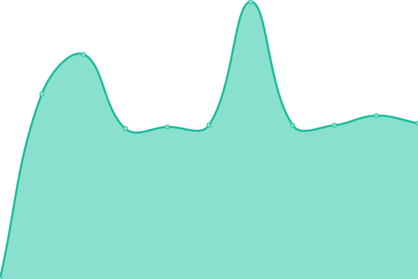
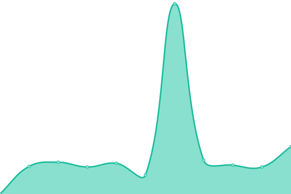

# [📈 Live Status](https://SocialGouv.github.io/upptime): <!--live status--> **🟩 All systems operational**

This repository contains the open-source uptime monitor and status page for [Fabrique numérique des Ministères Sociaux](https://incubateur.social.gouv.fr), powered by [Upptime](https://github.com/upptime/upptime).

With [Upptime](https://upptime.js.org), you can get your own unlimited and free uptime monitor and status page, powered entirely by a GitHub repository. We use [Issues](https://github.com/SocialGouv/upptime/issues) as incident reports, [Actions](https://github.com/SocialGouv/upptime/actions) as uptime monitors, and [Pages](https://SocialGouv.github.io/upptime) for the status page.

<!--start: status pages-->
<!-- This summary is generated by Upptime (https://github.com/upptime/upptime) -->
<!-- Do not edit this manually, your changes will be overwritten -->
<!-- prettier-ignore -->
| URL | Status | History | Response Time | Uptime |
| --- | ------ | ------- | ------------- | ------ |
|  [Fabrique](https://fabrique.social.gouv.fr) | 🟩 Up | [fabrique.yml](https://github.com/SocialGouv/upptime/commits/HEAD/history/fabrique.yml) | 

 1252ms
     
 | 

<a href="https://SocialGouv.github.io/upptime/history/fabrique">100.00%</a>
    

|  [Index EgaPro](http://index-egapro.travail.gouv.fr/) | 🟩 Up | [index-ega-pro.yml](https://github.com/SocialGouv/upptime/commits/HEAD/history/index-ega-pro.yml) | 

 831ms
     
 | 

<a href="https://SocialGouv.github.io/upptime/history/index-ega-pro">100.00%</a>
    

|  [Code du travail](https://code.travail.gouv.fr) | 🟩 Up | [code-du-travail.yml](https://github.com/SocialGouv/upptime/commits/HEAD/history/code-du-travail.yml) | 

 1061ms
     
 | 

<a href="https://SocialGouv.github.io/upptime/history/code-du-travail">100.00%</a>
    

|  [siret2idcc](https://siret2idcc.fabrique.social.gouv.fr/api/v2/82161143100015,80258570300027) | 🟩 Up | [siret2idcc.yml](https://github.com/SocialGouv/upptime/commits/HEAD/history/siret2idcc.yml) | 

 534ms
     
 | 

<a href="https://SocialGouv.github.io/upptime/history/siret2idcc">100.00%</a>
    

|  [serving-ml](https://serving-ml.fabrique.social.gouv.fr/v1/models/sentqam) | 🟩 Up | [serving-ml.yml](https://github.com/SocialGouv/upptime/commits/HEAD/history/serving-ml.yml) | 

 507ms
     
 | 

<a href="https://SocialGouv.github.io/upptime/history/serving-ml">100.00%</a>
    

|  [emjpm](https://emjpm.fabrique.social.gouv.fr) | 🟩 Up | [emjpm.yml](https://github.com/SocialGouv/upptime/commits/HEAD/history/emjpm.yml) | 

 492ms
     
 | 

<a href="https://SocialGouv.github.io/upptime/history/emjpm">99.53%</a>
    

|  [portail PJM](https://pjm.social.gouv.fr/) | 🟩 Up | [portail-pjm.yml](https://github.com/SocialGouv/upptime/commits/HEAD/history/portail-pjm.yml) | 

 688ms
     
 | 

<a href="https://SocialGouv.github.io/upptime/history/portail-pjm">100.00%</a>
    

|  [covid-19](https://covid-19.sante.gouv.fr) | 🟩 Up | [covid-19.yml](https://github.com/SocialGouv/upptime/commits/HEAD/history/covid-19.yml) | 

 715ms
     
 | 

<a href="https://SocialGouv.github.io/upptime/history/covid-19">100.00%</a>
    

|  [TuMePlay](https://tumeplay.fabrique.social.gouv.fr/) | 🟩 Up | [tu-me-play.yml](https://github.com/SocialGouv/upptime/commits/HEAD/history/tu-me-play.yml) | 

 1038ms
     
 | 

<a href="https://SocialGouv.github.io/upptime/history/tu-me-play">100.00%</a>
    

|  [medlé](https://medle.fabrique.social.gouv.fr/) | 🟩 Up | [medle.yml](https://github.com/SocialGouv/upptime/commits/HEAD/history/medle.yml) | 

 467ms
     
 | 

<a href="https://SocialGouv.github.io/upptime/history/medle">100.00%</a>
    

|  [ONVS](https://onvs.fabrique.social.gouv.fr/) | 🟩 Up | [onvs.yml](https://github.com/SocialGouv/upptime/commits/HEAD/history/onvs.yml) | 

 722ms
     
 | 

<a href="https://SocialGouv.github.io/upptime/history/onvs">100.00%</a>
    

|  [DomiFa](https://domifa.fabrique.social.gouv.fr/) | 🟩 Up | [domi-fa.yml](https://github.com/SocialGouv/upptime/commits/HEAD/history/domi-fa.yml) | 

 506ms
     
 | 

<a href="https://SocialGouv.github.io/upptime/history/domi-fa">100.00%</a>
    

|  [Standup](https://standup.fabrique.social.gouv.fr/healthz) | 🟩 Up | [standup.yml](https://github.com/SocialGouv/upptime/commits/HEAD/history/standup.yml) | 

 482ms
     
 | 

<a href="https://SocialGouv.github.io/upptime/history/standup">100.00%</a>
    

|  [Carnets](https://carnets.fabrique.social.gouv.fr/api/healthz) | 🟩 Up | [carnets.yml](https://github.com/SocialGouv/upptime/commits/HEAD/history/carnets.yml) | 

 488ms
     
 | 

<a href="https://SocialGouv.github.io/upptime/history/carnets">100.00%</a>
    

|  [Archifiltre](https://archifiltre.fabrique.social.gouv.fr/) | 🟩 Up | [archifiltre.yml](https://github.com/SocialGouv/upptime/commits/HEAD/history/archifiltre.yml) | 

 682ms
     
 | 

<a href="https://SocialGouv.github.io/upptime/history/archifiltre">100.00%</a>
    

|  [MonSuiviPsy](https://monsuivipsy.fabrique.social.gouv.fr/) | 🟩 Up | [mon-suivi-psy.yml](https://github.com/SocialGouv/upptime/commits/HEAD/history/mon-suivi-psy.yml) | 

 527ms
     
 | 

<a href="https://SocialGouv.github.io/upptime/history/mon-suivi-psy">100.00%</a>
    

|  [OzEnsemble](https://ozensemble.fabrique.social.gouv.fr/) | 🟩 Up | [oz-ensemble.yml](https://github.com/SocialGouv/upptime/commits/HEAD/history/oz-ensemble.yml) | 

 553ms
     
 | 

<a href="https://SocialGouv.github.io/upptime/history/oz-ensemble">100.00%</a>
    

|  [Matomo](https://matomo.fabrique.social.gouv.fr/) | 🟩 Up | [matomo.yml](https://github.com/SocialGouv/upptime/commits/HEAD/history/matomo.yml) | 

 2584ms
     
 | 

<a href="https://SocialGouv.github.io/upptime/history/matomo">100.00%</a>
    

|  [Sentry](https://sentry.fabrique.social.gouv.fr/) | 🟩 Up | [sentry.yml](https://github.com/SocialGouv/upptime/commits/HEAD/history/sentry.yml) | 

 930ms
     
 | 

<a href="https://SocialGouv.github.io/upptime/history/sentry">100.00%</a>
    

|  [Mattermost](https://mattermost.fabrique.social.gouv.fr/) | 🟩 Up | [mattermost.yml](https://github.com/SocialGouv/upptime/commits/HEAD/history/mattermost.yml) | 

 545ms
     
 | 

<a href="https://SocialGouv.github.io/upptime/history/mattermost">100.00%</a>
    

|  [NextCloud](https://nextcloud.fabrique.social.gouv.fr/) | 🟩 Up | [next-cloud.yml](https://github.com/SocialGouv/upptime/commits/HEAD/history/next-cloud.yml) | 

 914ms
     
 | 

<a href="https://SocialGouv.github.io/upptime/history/next-cloud">100.00%</a>
    

|  [Sample Next App](https://sample-next-app.fabrique.social.gouv.fr) | 🟩 Up | [sample-next-app.yml](https://github.com/SocialGouv/upptime/commits/HEAD/history/sample-next-app.yml) | 

 448ms
     
 | 

<a href="https://SocialGouv.github.io/upptime/history/sample-next-app">100.00%</a>
    

|  [GitLab](https://gitlab.factory.social.gouv.fr) | 🟩 Up | [git-lab.yml](https://github.com/SocialGouv/upptime/commits/HEAD/history/git-lab.yml) | 

 875ms
     
 | 

<a href="https://SocialGouv.github.io/upptime/history/git-lab">100.00%</a>
    

<!--end: status pages-->

[**Visit our status website →**](https://SocialGouv.github.io/upptime)

## 📄 License

- Code: [MIT](./LICENSE) © [Fabrique numérique des Ministères Sociaux](https://incubateur.social.gouv.fr)
- Data in the `./history` directory: [Open Database License](https://opendatacommons.org/licenses/odbl/1-0/)
