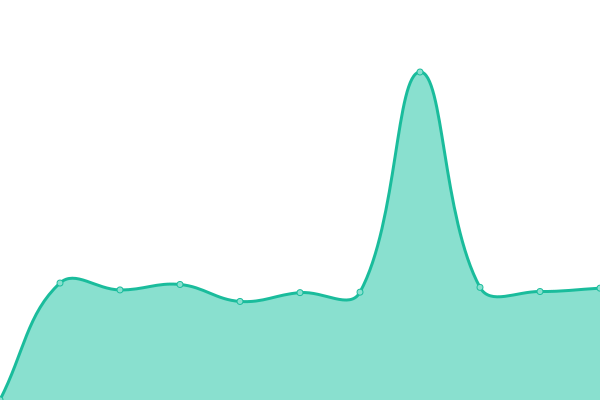
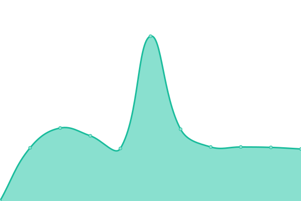
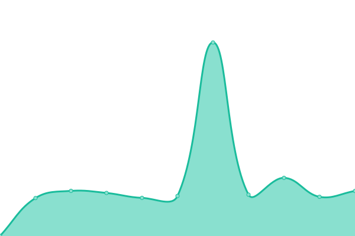
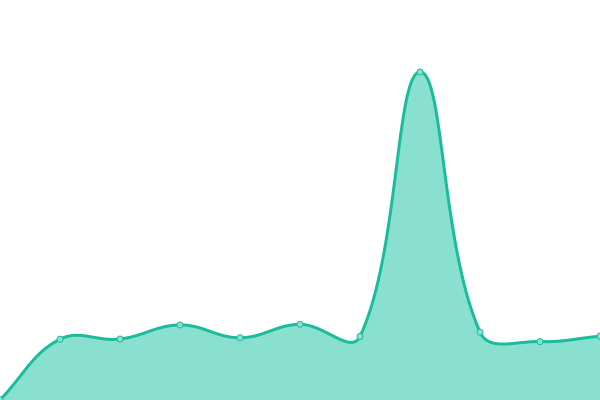
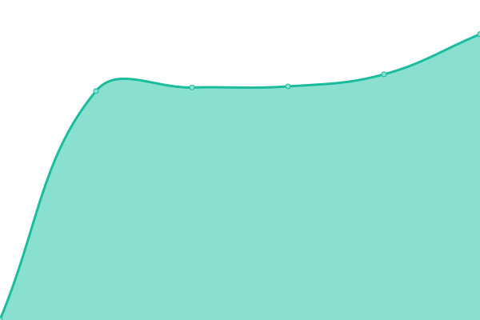
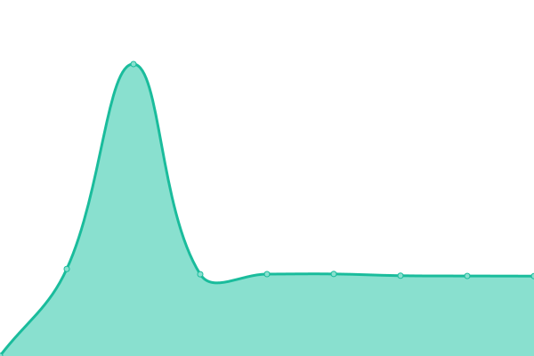
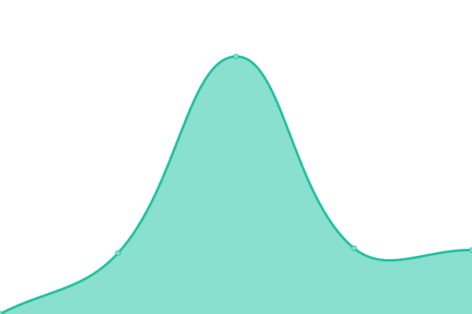

# [📈 Live Status](https://SocialGouv.github.io/upptime): <!--live status--> **🟧 Partial outage**

This repository contains the open-source uptime monitor and status page for [Fabrique numérique des Ministères Sociaux](https://incubateur.social.gouv.fr), powered by [Upptime](https://github.com/upptime/upptime).

With [Upptime](https://upptime.js.org), you can get your own unlimited and free uptime monitor and status page, powered entirely by a GitHub repository. We use [Issues](https://github.com/SocialGouv/upptime/issues) as incident reports, [Actions](https://github.com/SocialGouv/upptime/actions) as uptime monitors, and [Pages](https://SocialGouv.github.io/upptime) for the status page.

<!--start: status pages-->
<!-- This summary is generated by Upptime (https://github.com/upptime/upptime) -->
<!-- Do not edit this manually, your changes will be overwritten -->

| URL                                                                                           | Status  | History                                                                                                                     | Response Time                                                                                  | Uptime                                                                                                                                                                                                                                                    |
| --------------------------------------------------------------------------------------------- | ------- | --------------------------------------------------------------------------------------------------------------------------- | ---------------------------------------------------------------------------------------------- | --------------------------------------------------------------------------------------------------------------------------------------------------------------------------------------------------------------------------------------------------------- |
| [Fabrique](https://fabrique.social.gouv.fr)                                                   | 🟩 Up   | [fabrique.yml](https://github.com/SocialGouv/upptime/commits/master/history/fabrique.yml)                                   |  1184ms                 |                                    |
| [Index EgaPro](http://index-egapro.travail.gouv.fr/)                                          | 🟩 Up   | [index-ega-pro.yml](https://github.com/SocialGouv/upptime/commits/master/history/index-ega-pro.yml)                         |  731ms             |                          |
| [Code du travail numérique](https://code.travail.gouv.fr)                                     | 🟩 Up   | [code-du-travail-numerique.yml](https://github.com/SocialGouv/upptime/commits/master/history/code-du-travail-numerique.yml) |  988ms |  |
| [siret2idcc](https://siret2idcc.fabrique.social.gouv.fr/api/v2/82161143100015,80258570300027) | 🟩 Up   | [siret2idcc.yml](https://github.com/SocialGouv/upptime/commits/master/history/siret2idcc.yml)                               |  566ms                |                                |
| [emjpm](https://emjpm.fabrique.social.gouv.fr)                                                | 🟩 Up   | [emjpm.yml](https://github.com/SocialGouv/upptime/commits/master/history/emjpm.yml)                                         |  827ms                     |                                          |
| [work-in-france](https://work-in-france.fabrique.social.gouv.fr)                              | 🟩 Up   | [work-in-france.yml](https://github.com/SocialGouv/upptime/commits/master/history/work-in-france.yml)                       |  581ms            |                        |
| [covid-19](https://covid-19.sante.gouv.fr)                                                    | 🟩 Up   | [covid-19.yml](https://github.com/SocialGouv/upptime/commits/master/history/covid-19.yml)                                   |  700ms                  |                                    |
| [TuMePlay](https://tumeplay.fabrique.social.gouv.fr/)                                         | 🟩 Up   | [tu-me-play.yml](https://github.com/SocialGouv/upptime/commits/master/history/tu-me-play.yml)                               |  581ms                |                                |
| [medlé](https://medle.fabrique.social.gouv.fr/)                                               | 🟩 Up   | [medle.yml](https://github.com/SocialGouv/upptime/commits/master/history/medle.yml)                                         |  429ms                     |                                          |
| [ONVS](https://onvs.fabrique.social.gouv.fr/)                                                 | 🟩 Up   | [onvs.yml](https://github.com/SocialGouv/upptime/commits/master/history/onvs.yml)                                           |  557ms                      |                                            |
| [DomiFa](https://domifa.fabrique.social.gouv.fr/)                                             | 🟩 Up   | [domi-fa.yml](https://github.com/SocialGouv/upptime/commits/master/history/domi-fa.yml)                                     |  380ms                   |                                      |
| [Standup](https://standup.fabrique.social.gouv.fr/)                                           | 🟩 Up   | [standup.yml](https://github.com/SocialGouv/upptime/commits/master/history/standup.yml)                                     |  1123ms                  |                                      |
| [Carnets](https://carnets.fabrique.social.gouv.fr/)                                           | 🟩 Up   | [carnets.yml](https://github.com/SocialGouv/upptime/commits/master/history/carnets.yml)                                     |  804ms                   |                                      |
| [Archifiltre](https://archifiltre.fabrique.social.gouv.fr/)                                   | 🟩 Up   | [archifiltre.yml](https://github.com/SocialGouv/upptime/commits/master/history/archifiltre.yml)                             |  561ms               |                              |
| [MonSuiviPsy](https://monsuivipsy.fabrique.social.gouv.fr/)                                   | 🟩 Up   | [mon-suivi-psy.yml](https://github.com/SocialGouv/upptime/commits/master/history/mon-suivi-psy.yml)                         |  641ms             |                          |
| [OzEnsemble](https://ozensemble.fabrique.social.gouv.fr/)                                     | 🟥 Down | [oz-ensemble.yml](https://github.com/SocialGouv/upptime/commits/master/history/oz-ensemble.yml)                             |  0ms                 |                                |

<!--end: status pages-->

[**Visit our status website →**](https://SocialGouv.github.io/upptime)

## 📄 License

- Code: [MIT](./LICENSE) © [Fabrique numérique des Ministères Sociaux](https://incubateur.social.gouv.fr)
- Data in the `./history` directory: [Open Database License](https://opendatacommons.org/licenses/odbl/1-0/)
